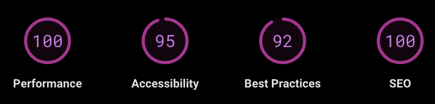
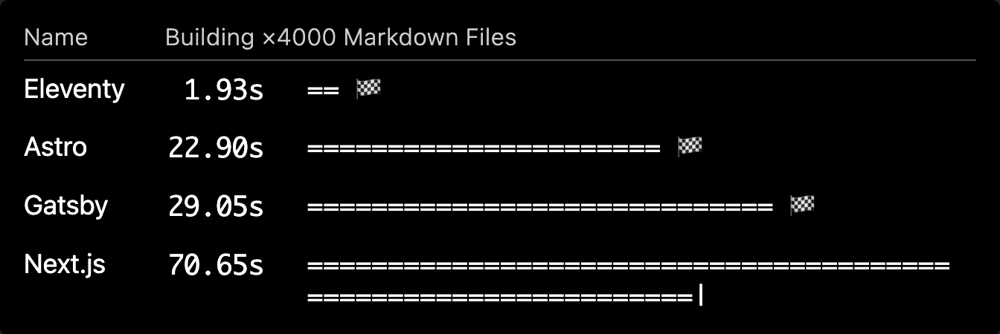

# Bonus Drop #9 (2023-04-02): There. Are. Four. Hundos.
Eleventy; Penthouse/Critical CSS; 

There's no foolin' the next-level supporters of the Drop! Meaning: I deliberately avoided posting the Bonus Drop yesterday, lest have ye wondering if any given topic was duplicitous or faithful.

Portions of non-Drop activities have leaked their way into these newsletters, including today's. 

As I was creating my most recent [web-centric WebR experiment](https://rud.is/w/webr-lit-plot/)—FOOT— I learned a new term: "Four Hundos". This is in the context of [Google Lighthouse scores](https://pagespeed.web.dev/analysis/https-rud-is-w-webr-lit-plot/4zg2reow30?form_factor=desktop):


(these would be green if I had not lazily inverted them to avoid blinding dark-mode folks)

where folks in front-end land seem to acquire bragging rights _(rightfully so!)_ for achieving a "perfect four" on both desktop and mobile browsers.

So, today, we'll explore a (relatively) new [static site generator](https://en.wikipedia.org/wiki/Static_site_generator) that is both creator- and "hundos"-friendly and a tool/site to help you up-level your CSS (since, we are all kind of web publishers, now).


### Eleventy


If you've been bouncing around the internets of late, you have most certainly come across at least one site that uses Eleventy ([11ty.dev](https://www.11ty.dev/)).

Out of the gate, it decides to show off, both by proclaiming how "easy" it is and then how fast it is:



11ty also shows its javascript roots right up front, _and that's OK_! Don't dismiss it just because you may need to work in `npm`-land. Read on, to see why, especially if you like making fast, secure, and easily maintainable websites using data and templates with almost zero hassle.

I can still hear you muttering: "I already use Markdown and $NAME site generator." What's it like living with such a restriction? Eleventy supports a wide range of templating languages such as HTML _(duh)_, Markdown _(ofc)_, [Liquid](https://shopify.github.io/liquid/), [Nunjucks](https://mozilla.github.io/nunjucks/), [Handlebars](https://handlebarsjs.com/), [Mustache](https://mustache.github.io/), [EJS](https://ejs.co/), [Haml](https://haml.info/), and many others. You may discover you work better in another (or, _many_!) one; or, if you publish a team, other members can work in what fits their style.

One of the main reasons folks gravitate towards Eleventy is its ease of use. Here are three additional aspects (besides the aforementioned "template" thing) that contribute to its simplicity:

- _Zero Configuration_: 11ty works out of the box without any configuration, making it incredibly easy to get started. You can create a new project and start building your site with minimal setup.
- _Extensive Documentation_: 11ty has seriously comprehensive documentation covers everything from installation to advanced customization. You can start using 11ty regardless of your current skill level.
- _Batteries Included/Available_: 11ty ships with an incredible about of functionality, but it has a rich ecosystem and very active community.

Sites built with Eleventy are "static", just like other ones (e.g. Hugo, Quarto, Jekyll), so this is a big reason for their speed claim. They also perform incremental content builds _(a feature also in other generators, like Quarto)_ meaning that only the files that have changed will be rebuilt. This feature significantly reduces build times, especially for large projects. Unlike many things in javascript-land, 11ty has minimal dependencies, which further help speed up builds.

Seeing is believing. Perhaps I'll coax you into trying it out by taking the source for this Bonus Edition (I start all Drops in markdown) and put it into a slightly more-than-bare-bones 11ty site.

```
mkdir 11ty-drop
cd 11ty-drop

# you need npm

# start a new project
npm init -y

# install 11ty
npm install @11ty/eleventy --save-dev

# copy files/dirs i use to craft the Drops

# build the site
npx @11ty/eleventy

# serve it (which will perform incremental builds)
npx @11ty/eleventy --serve

# create a `.eleventy.js` config file
touch .eleventy.js

# i put addditions step-by-step in there

# create a "template" for our "site"
mkdir _includes
touch core.njk

# add the simple nunjuks template you see in the GH repo I made for this

# add the basic CSS I mis-use everywhere (it's in the repo)

# one more time
npx @11ty/eleventy
```

It would have worked _just fine_ if you just added some markdown in `index.md`, but it would not have been "pretty". This basic structure is at least tolerable to the eyes.

I'll leave you with one more resource to convince you give 11ty a go. _(I'll be showing more 11ty bits in future Drops, so you can't escape!)_

"6 minutes to Build a Blog from Scratch."
https://www.youtube.com/watch?v=kzf9A9tkkl4

### Penthouse/Critical CSS


This'll be quick…!

[Penthouse](https://github.com/pocketjoso/penthouse) is _the original critical path css generator, helping you out to speed up page rendering for your websites. Supply your site's full CSS and the page you want to create the critical CSS for, and Penthouse will return the critical CSS needed to perfectly render the above the fold content of the page"._

If "critical path CSS" sounds formal/daunting it kind of "is" and "isn't" at the same time.

Our human inability to have patience and Google's march (via SEO/Lighthouse) to ensure we do not have patience means it is _kind of_ important to get decent looking content to the eyes of consumers as quickly as possible. That's created an entire wonk-industry around how to measure and improve "performance".

"Critical path CSS" refers to the minimum set of CSS rules required to style the content that is visible to the user when the web page initially loads. Essentially, it's the CSS necessary to make the first impression of the website visually appealing and properly formatted.

When a web page loads, the browser needs to download, parse, and apply CSS to display the content correctly. However, not all CSS rules are needed right away; some of them apply to content that isn't visible until the user scrolls down or interacts with the page. By identifying and prioritizing the critical path CSS, you can improve the perceived loading speed of your website. This is because the browser can render the visible content quickly without waiting for the entire CSS file to load, resulting in a better user experience.

You can read _alot_ more about that [here](https://www.phpied.com/css-and-the-critical-path/).

Penthouse (odd name, but it's because CSS is at the top of the page). 

It's _another_ javascript tool, and, you may be tired of that in this issue, so why not just [use it online](https://jonassebastianohlsson.com/criticalpathcssgenerator/)! Input a URL and your CSS and 💥, you've got faster load times.

This tool/site may just help you get all Four Hundos!

### FIN

Just two extra topics since I spent far too much time, this weekend, on a [non-web WebR project](https://github.com/hrbrmstr/macoswasmr) that I think a few folks will find useful, and you got an entire 11ty starter project with this one 🙃.

Thank ye once more for your support! ☮
